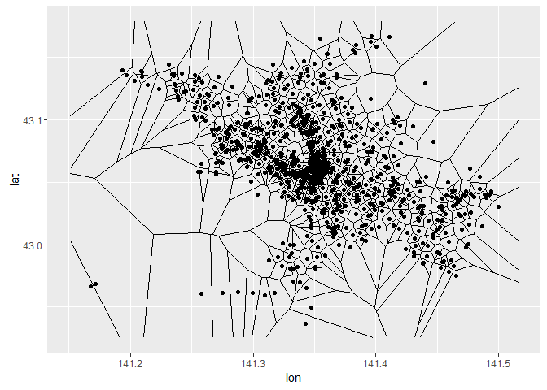
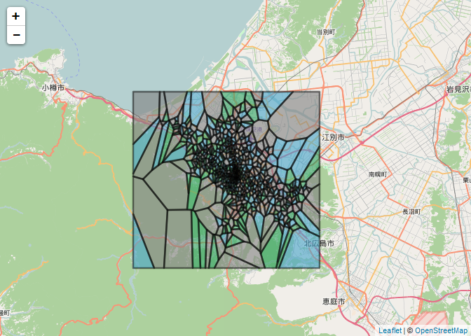
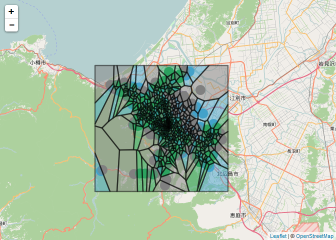

データの準備
------------

札幌市内全域のコンビニ(セブン、ローソン、セイコマート)の緯度経度データセット
合計825店

|    |      lat|      lon|store          |
|:---|--------:|--------:|:--------------|
|811 | 43.07468| 141.3525|セブンイレブン |
|812 | 43.07523| 141.3476|セブンイレブン |
|813 | 43.08075| 141.3474|セブンイレブン |
|814 | 43.08828| 141.3454|セブンイレブン |
|815 | 43.08960| 141.3403|セブンイレブン |
|816 | 43.09110| 141.3472|セブンイレブン |
|817 | 43.09607| 141.3237|セブンイレブン |
|818 | 43.09528| 141.3413|セブンイレブン |
|819 | 43.09566| 141.3326|セブンイレブン |
|820 | 43.09809| 141.3392|セブンイレブン |
|821 | 43.10075| 141.3325|セブンイレブン |
|822 | 43.10063| 141.3441|セブンイレブン |
|823 | 43.10258| 141.3402|セブンイレブン |
|824 | 43.10580| 141.3370|セブンイレブン |
|825 | 43.06910| 141.3480|セブンイレブン |

ボロノイ分割
```r

    #描画の範囲を固める
    xrng <- scales::expand_range(range(df$lon), .05)
    yrng <- scales::expand_range(range(df$lat), .05)

    #ボロノイ分割(戻り値はlist)
    result_deldir <- deldir::deldir(x=df$lon,y=df$lat, rw = c(xrng, yrng))
    tilelist <- deldir::tile.list(result_deldir) #分割したtileを取得

    #内部構造を見てみる
    tilelist[[721]]

    ## $ptNum
    ## [1] 721
    ##
    ## $pt
    ##        x        y
    ## 141.3738  43.0438
    ##
    ## $x
    ## [1] 141.3774 141.3742 141.3726 141.3700 141.3699 141.3741 141.3743
    ##
    ## $y
    ## [1] 43.04427 43.04729 43.04783 43.04516 43.04426 43.04001 43.04001
    ##
    ## $bp
    ## [1] FALSE FALSE FALSE FALSE FALSE FALSE FALSE

    #ボロノイ???割の結果を見てみ???
    ggplot2::qplot(lon, lat, data = df)+geom_segment(aes(x = x1, y = y1, xend = x2, yend = y2), size = .25,data = result_deldir$dirsgs)

```



```r
    #ポリゴン変換
    polys<-vector(mode='list', length=length(tilelist))
    for (i in seq(along=polys)) {
      voronoi<-cbind(tilelist[[i]]$x, tilelist[[i]]$y)
      voronoi<-rbind(voronoi, voronoi[1,])
      polys[[i]]<-Polygons(list(Polygon(voronoi)), ID=as.character(i))
    }

    SP<-SpatialPolygons(polys)
    slotNames(SP)

    ## [1] "polygons"    "plotOrder"   "bbox"        "proj4string"

    #ドロネー点を取得してマージしたかった
    #tiledf <- delsgs %>%
      #dplyr::inner_join(.,df,by=c("lon","lat")) #ドロネー点の緯度経度が完全一致でないためできない

    #----------------------------------------------------------------------------------
    # tiledf2の緯度経度とdfの緯度経度を比較して最も近い店舗の名前を取得

    # ptに店の緯度経度とほぼ同じ緯度経度が入っている
    tiledf <- dplyr::bind_rows(lapply(tilelist, function(l){
      data.frame(tile = l$ptNum, lon = l$pt["x"], lat = l$pt["y"])
    }))
    # 近傍点を返す関数を定義
    getNearPoint <- function(x, y){
      tmp <- dplyr::bind_rows(x, y)[,c("lon", "lat")]
      res <- as.matrix(dist(tmp))[-1,1]
      result <- y[which.min(res), "store"]
      return(result)
    }

    # 近傍点のコンビニ名を入れる
    for(i in seq(nrow(tiledf))){
      tiledf$store[i] <- getNearPoint(tiledf[i,], df)
    }
    #------------------------------------------------------------------------------------

    #rownumberがそろってな???と???めで、かつdataはdataframeの???要あ???
    voronoi<-SpatialPolygonsDataFrame(SP,data=as.data.frame(tiledf))
```

描画をします
```r
    #viewの準備
    sapporo <- leaflet() %>% setView(lng = 141.3508, lat = 43.06862,zoom = 10)
    #色セ???ト???定義
    pal <- colorFactor(c("#e34a33", "#2ca25f","#43a2ca"), domain = c("セイコーマ??????", "セブンイレブン","ローソン"))

    sapporo %>%
      addProviderTiles("OpenStreetMap.Mapnik") %>%
      addPolygons(stroke=FALSE,data = voronoi,color=~pal(store),fillOpacity = 0.6) %>%
      addPolylines(data = voronoi,color = "black",weight = 2.5)

```


きちんと店舗と同じ色になっているかどうかも見てみる

```r
    sapporo %>%
      addProviderTiles("OpenStreetMap.Mapnik") %>%
      addCircleMarkers(stroke=FALSE,data = df,~lon, ~lat,color=~pal(store),fillOpacity = 1) %>%
      addPolygons(stroke=FALSE,data = voronoi,color=~pal(store),fillOpacity = 0.5) %>%
      addPolylines(data = voronoi,color = "black",weight = 2.5)
```



おわり
